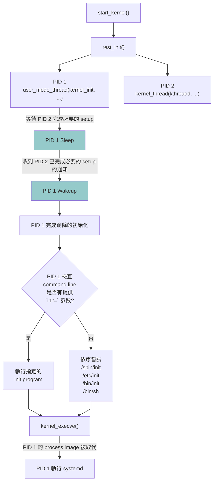

# Kernel initialization 交接給 Init task

## 流程圖



## kernel 進入 rest_init()

`start_kernel()` 完成許多 subsystem 的 initialization，包含:
- architecture-specific initialization
- memory management initialization
- scheduler initialization
- interrupt initialization
- VFS initialization
- driver initialization

`start_kernel()` 最後呼叫 `rest_init()` 

這代表 kernel 的主要 initialization 階段已經完成，接下來進入**建立 kernel threads 和啟動 userspace**的階段。

## 建立 Init task

`rest_init()` 建立 Init task。

[ function rest_init() in init/main.c ](https://elixir.bootlin.com/linux/v6.14/source/init/main.c#L703)

```c=703
	/*
	 * We need to spawn init first so that it obtains pid 1, however
	 * the init task will end up wanting to create kthreads, which, if
	 * we schedule it before we create kthreadd, will OOPS.
	 */
	pid = user_mode_thread(kernel_init, NULL, CLONE_FS);
```

Init task 取得 PID 1。並執行 `kernel_init` 函式

[ function kernel_init() in init/main.c ](https://elixir.bootlin.com/linux/v6.14/source/init/main.c#L1452)
```c=1452
	/*
	 * Wait until kthreadd is all set-up.
	 */
	wait_for_completion(&kthreadd_done);
```

Init task 在開始進行後續 initialization 前，會透過 `wait_for_completion(&kthreadd_done)` 進入等待狀態。

Init task 在此時需要進入等待狀態的原因是
* 後續 init task 需要建立其他的 kernel threads。

kernel 使用 PID 2 `kthreadd` 協助建立其他的 kernel threads
因此 Init task 需要等待 PID 2 `kthreadd` 完成必要的 setup。
 
## 建立 kernel thread 

`rest_init()` 建立 kernel thread。 kernel thread 執行 `kthreadd` 函式。

[ function rest_init() in init/main.c ](https://elixir.bootlin.com/linux/v6.14/source/init/main.c#L721)

```c=721
	pid = kernel_thread(kthreadd, NULL, NULL, CLONE_FS | CLONE_FILES);
```

kernel thread 取得 PID 2。`kthreadd` 已完成必要的 setup 後, kernel 可以使用 PID 2 協助建立其他的 kernel threads。

[ function rest_init() in init/main.c ](https://elixir.bootlin.com/linux/v6.14/source/init/main.c#L721)

```c=735
    complete(&kthreadd_done);
```

發出 PID 2 已完成必要的 setup 的通知。讓 PID 1 可以繼續後續的初始化工作。

## PID 1 執行 init program 

PID 1 完成剩餘的初始化後, 準備執行 userspace init program。

如果 kernel command line 有提供 `init=` 參數的話，使用指定的 init program

[ function kernel_init() in init/main.c ](https://elixir.bootlin.com/linux/v6.14/source/init/main.c#L1490)

```c=1490
	/*
	 * We try each of these until one succeeds.
	 *
	 * The Bourne shell can be used instead of init if we are
	 * trying to recover a really broken machine.
	 */
	if (execute_command) {
		ret = run_init_process(execute_command);
		if (!ret)
			return 0;
		panic("Requested init %s failed (error %d).",
		      execute_command, ret);
	}

```

否則按照預設的順序，執行以下的 init program
* `/sbin/init`
* `/etc/init`
* `/bin/init`
* `/bin/sh`

[ function kernel_init() in init/main.c ](https://elixir.bootlin.com/linux/v6.14/source/init/main.c#L1513)

```c=1513
if (!try_to_run_init_process("/sbin/init") ||
    !try_to_run_init_process("/etc/init") ||
    !try_to_run_init_process("/bin/init") ||
    !try_to_run_init_process("/bin/sh"))
    return 0;
```

[ function run_init_process() in init/main.c ](https://elixir.bootlin.com/linux/v6.14/source/init/main.c#L1378)

```c=1378
    return kernel_execve(init_filename, argv_init, envp_init);
```

目前大多數的 Linux 系統將 `/sbin/init`  link 到 `/usr/lib/systemd/systemd`。

`kernel_init` 用 `kernel_execve` 去執行 `/sbin/init` 後，PID 1 的 process image 被 systemd 取代，並開始執行 userspace init program。

## reference

* [Linux-insides Initialization Chapter 第 10 篇 End of the Linux kernel initialization process 第 2-4 段 First steps after the start_kernel](https://0xax.gitbook.io/linux-insides/summary/initialization/linux-initialization-10#first-steps-after-the-start_kernel)
* [Jason-Note: Chapter 6 : User Space Initialization](https://jasonblog.github.io/note/linux_kernel/chapter_6__user_space_initialization.html)
