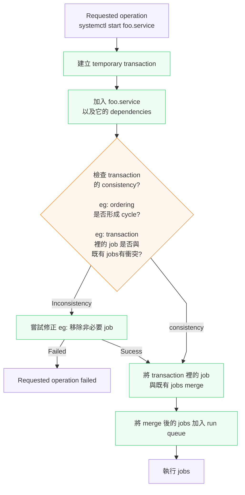

# Systemd 簡介

## description

systemd 是一個專用於 Linux 作業系統的 system and service manager。 當作為啟動時的第一個 process（PID 為 1）運行時，它將扮演 init system， 也就是啟動並維護各種 userspace 的服務。系統會為已登入使用者啟動 seperate instance ，以便使用者啟動自己的服務。

systemd 通常不是由 user 直接呼叫的，systemd 是**以 Symbolic link `/sbin/init` 安裝**，並在 early boot 階段啟動。User manager instances 透過 `user@.service(5)` 服務自動啟動。

* 當 systemd 作為 system instance 運作時，systemd 將會按照 `system.conf` 配置檔案以及 `system.conf.d` 配置目錄中的指令工作; 
* 當 systemd 作為 user instance 運作時，systemd 將會按照 `user.conf` 配置檔案以及 `user.conf.d` 配置目錄中的指令工作。

詳見 systemd-system.conf(5) 手冊。

> systemd 作為 PID 1 執行時，是 system instance；
> 而登入的每個使用者，還可能有自己的 user instance

systemd 包含各種需要在啟動過程中執行的 process 的本機實作。例如，它可以設定 hostname 或配置 loop network device。systemd 還可以**設定和掛載**各種 API **檔案系統**，例如 /sys/、/proc/ 和 /dev/

如果系統時鐘設定不正確，systemd 也會在啟動初期重置系統時鐘。

## Units

在 systemd 中，Unit 指的是系統能夠操作和管理的任何 resource。Unit 是 systemd 使用的主要 Object。Unit 封裝了與系統啟動和維護相關的各種 Object。

大多數 Unit 都在 unit configuration file 中配置，其語法和基本選項集在 `systemd.unit(5)` 中描述。

### Unit 創建方式

但是有些 Unit 是從其他 configuration file 自動創建的。
Unit 也可以從 system state 動態創建，
Unit 也可以在 runtime 時以 programming 方式創建。

### Unit 狀態

Unit 可能處於**以下表格**所述的 **state**。

請注意，不同 Unit 類型可能具有許多附加 substate，這些 substate 會對應到此處所述的通用 Unit state。

| State | Description |
| ----- | ----------- |
| `active` | Started, bound, plugged in, ..., depending on the unit type. |
| `inactive` | Stopped, unbound, unplugged, ..., depending on the unit type. |
| `failed` | Similar to **inactive**, 但 Unit 出現某種故障<br>( process 退出時返回錯誤代碼、crashed、操作逾時或重啟次數過多 ) |
| `activating` | Changing from **inactive** to **active**. |
| `deactivating` | Changing from **active** to **inactive**. |
| `maintenance` | Unit is **inactive** Unit 正在進行維護作業。|
| `reloading` | Unit is **active**。 Unit 正在重新載入其配置。|
| `refreshing` | Unit is **active**。 Unit 在其 namespace 中啟動了一個新的掛載點。|

## Unit type

各種不同的 Unit type 如下：

| Unit type | Description |
| --------- | ----------- |
| Service Unit | Service Unit 用於啟動並控制 daemon，以及 daemon 所包含的 processes。參見 systemd.service(5) 手冊。 |
| Socket Unit | Socket Unit 封裝了系統中的 local IPC 或 Network Socket，可用於 socket-based 的啟動。Socket Unit 把 socket 本身納入 systemd 的管理，並可以用 socket 來觸發 service activation。<br>有關 Socket Unit 的詳情，參見 systemd.socket(5) 手冊；<br>有關 Socket-base 或其他方式的啟動，參見 daemon(7) 手冊。 |
| Target Unit | Target Unit 用於將 Unit **分組**，或在啟動期間提供 well-known 的 synchronization points ，請參閱 systemd.target(5)。 |
| Device Unit | Device Unit 把 kernel 所知道的 device，以 Unit 的形式呈現在 systemd 的 dependency model 中。Device Unit 可用於實現 Device-Base 的啟動。有關詳細信息，請參閱 systemd.device(5)。|
| Mount Unit | Mount Unit 控制 file system 中的 mount point。<br>因此 Mount Unit 讓 mount 本身也進入 systemd 的 dependency model。有關詳細資訊請參閱 systemd.mount(5)。|
| Automount Unit | Automount Unit 提供 automount 功能。可按需求 mount filesystem。也就是不一定在 boot 時立刻 mount filesystem。<br>Automount Unit 協助 parallelized boot-up。請參閱 systemd.automount(5)。 |
| Timer Unit | Timer Unit 可用於根據 Timer 觸發其他 unit 的啟動。您可以在 systemd.timer(5) 中找到詳細資訊。|
| Swap Unit | Swap Unit 與 Mount Unit 非常相似，Swap Unit 封裝了作業系統的 **memory swap partitions** 或 file。|
| Path Unit | Path Unit 用於根據 File system 上**特定 object 的變化** ( eg: 某個 directory 出現新檔案 ) 來啟動其他服務。參見 systemd.path(5) 手冊。|
| Slice Unit | Slice Unit 可用於將管理系統 process 的 Unit（例如 Service Unit 和 Scope Unit）分組到階層樹中，以便進行資源管理。請參閱 systemd.slice(5)。|
| Scope Unit | Scope Unit 類似 Service Unit，但它**管理**的是外部 process，而不是啟動它們。參見 systemd.scope(5)。|

## Transaction

Transaction 是 systemd 為一次 Unit operation 暫時建立的一組 jobs。

當 systemd 收到 Unit 的啟動或停止要求時，會將 Unit 以及 Unit 的 dependencies 加入 temporary transaction。

systemd 在執行 transaction 前會：

1. 建立 temporary transaction
2. 加入 Unit 及其 dependencies 到 temporary transaction
3. 檢查 temporary transaction 是否 consistent，例如 ordering 是否形成 cycle
4. 如果**某些 jobs 不是必要的**，**systemd 可能移除它們**，以**消除 cycle**。
5. 如果 transaction 裡**有非必要的 job 會導致一個目前正在運行的 Service 被停止，systemd 也會嘗試抑制這些非必要 jobs**。<br>這樣做的目的是: **在滿足 operation 的前提下，盡量減少對目前系統狀態的影響。**
6. **檢查** transaction 裡的 **job 是否與已經 queued 的 jobs 衝突**
7. 若 transaction consistent，**將 transaction 裡的 job 與既有 jobs merge，並加入 run queue**
8. 執行 jobs

概念流程




### Transaction 的目的

Transaction 的目的，是讓 systemd 在真正執行 operation 前，先確認整個 operation 是否合理；如果可以修正就修正，只有在無法合理執行時才失敗。

### Transaction 與 Unit Runtime State 是獨立的

Transaction 的建立獨立於 Unit 當前的 runtime state。即使 Unit 已經是 active，對它發出 start request 仍可能建立 transaction，並根據 dependency relationships 產生其他 jobs。

例如 `systemctl start foo.service`，即使 `foo.service = active` systemd 仍然會建立 transaction。

假設目前 service 的 state 如下
```
foo.service = active
bar.service = inactive
```

eg: foo.service
```ini
[Unit]
Wants=bar.service
```

現在執行 `systemctl start foo.service`。雖然 `foo.service` 已經是 active，但 systemd 還是會建立 transaction。執行 `foo.service` 的 start job 時，systemd 發現 `foo.service` 已經 active。因此這個 start job 可以被標記為 `successful + complete`。但是 `bar.service` 仍然是 inactive，所以 `bar.service` 的 start job 仍然會被執行。

## 參考資料

[ arch linux 的 systemd manual 英文版](https://man.archlinux.org/man/systemd.1.en)
[ arch linux 的 systemd manual 繁中版](https://man.archlinux.org/man/systemd.1.zh_TW)
[ arch linux 的 systemd.service manual ](https://man.archlinux.org/man/systemd.service.5.en)
[ arch linux 的 systemd.unit manual ](https://man.archlinux.org/man/systemd.unit.5.en)

[ SUSE linux 的 systemd manual 英文版](https://documentation.suse.com/sle-micro/6.0/html/Micro-systemd-basics/index.html#concept-unit-dependencies)
[ SUSE linux 的 systemd manual 簡中版](https://documentation.suse.com/zh-cn/sle-micro/6.0/html/Micro-systemd-basics/index.html#concept-unit-dependencies)
